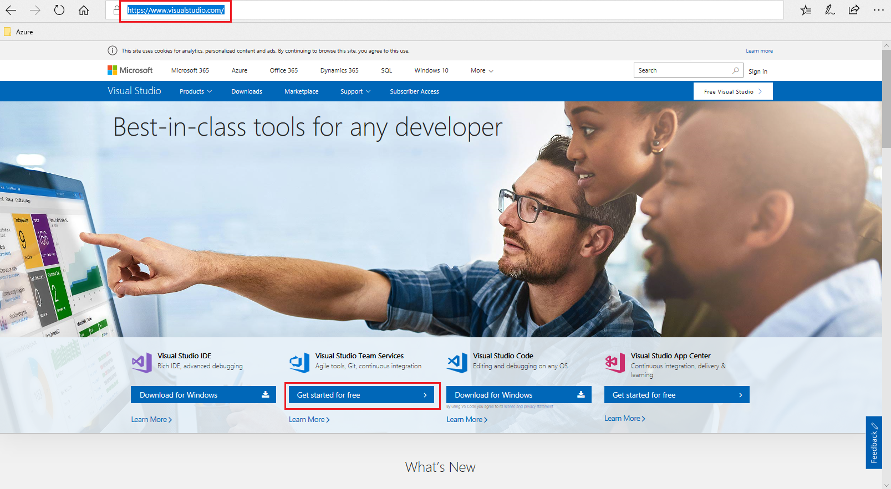
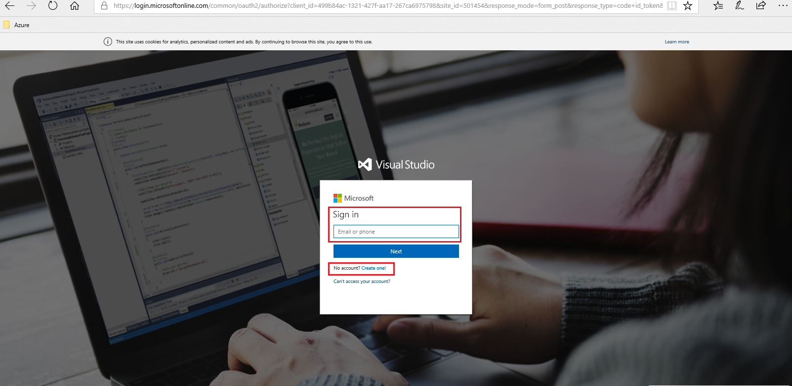

In this lab, we will set up the PartsUnlimited MRP VSTS team project as a pre-requisite for the Continuous Integration lab. You will need an active Visual Studio Team Services (VSTS) account, or you will need to sign up for a free Visual Studio Team Services account by following [this link.](https://www.visualstudio.com/en-us/docs/setup-admin/team-services/sign-up-for-visual-studio-team-services) Ensure that you are also a Project Collection Administrator for the Visual Studio Team Services account or follow [this link.](https://www.visualstudio.com/en-us/docs/setup-admin/add-administrator-tfs) 

<h3>DevOps MPP Course Source </h3>

- This lab is used in course <a href="https://www.edx.org/course/introduction-devops-practices-microsoft-devops200-1x-0" target="_blank">DevOps200.1x: DevOps Practices and Principles</a>: Module 2.

<h3>  Pre-Requisites:</h3>

-   An active Visual Studio Team Services (VSTS) account

-   Project Collection Administrator rights to the Visual Studio Team Services account

<h3> Lab Tasks:</h3>

**Set up your Visual Studio Team Services account:** This step helps you download the source code and then push it to your own Visual Studio Team Services account.

<h3>Estimated Lab Time:</h3>

Approximately 20 minutes  

### Task 1: Set up your Visual Studio Team Services account

Push the application code to your Visual Studio Team Services account to use Team Build for the Continuous Integration HOL.

**1.** First, navigate to your Visual Studio Team Services account by typing the following into a browser: 

    https://{VSTS instance name}.visualstudio.com

1. If you do not have a Visual Studio Team Services (VSTS) account, you can sign up for a free account by going to [http://www.visualstudio.com](http://www.visualstudio.com). Then, under Visual Studio Team Services, click on **Get Started for free**

2. Sign in with your **Microsoft account**. If you do not have a Microosft account, you can create one by clicking on **No account? Create one!** and following the steps.

    

**2.** Once you are signed in to your Visual Studio Team Services account, create a new PartsUnlimitedMRP team project by clicking on the **New** button under **Recent projects & teams**. Type in the project name as *PartsUnlimitedMRP* and select *git* as the version control, then click on **Create project**.

**3.** After the wizard creates your new team project, navigate to the PartsUnlimitedMRP team project and click on the **Code** tab on the upper-left. 

**4.** The PartsUnlimitedMRP git repository will be empty, so copy the Clone URL of the VSTS repository to your clipboard and paste it into a text document for later use. 

**5.** Clone the **PartsUnlimitedMRP** git repository located in GitHub onto your local machine, open your command line tool, and type :

    git clone https://github.com/Microsoft/PartsUnlimitedMRP.git

**NOTE:** If you are running Linux on your local workstation, install git:

    sudo apt-get install git
	
**NOTE:** If you are running Windows, you have to install the git client from here:

[http://git-scm.com/download](https://git-scm.com/download/win)

**6.** Add the Clone URL of your Visual Studio Team Services repository as a new remote called **vsts** (The URL previously copied in step 4) and push to it to your Visual Studio Team Services account. 

	cd PartsUnlimitedMRP/

	git remote add vsts <url_to_repository>

	git push -u vsts --all
	

**NOTE:** If this is the first time that you are using your Visual Studio Team Services subscription, it will ask you to be authenticated.

**NOTE:** We added the Visual Studio Team Services repository as a remote named **vsts**, so we need to
push to that remote in the future for our changes to appear in our Visual Studio Team Services
repository.

**7.** If you refresh your **CODE** section page, your Visual Studio Team Services account should now have a copy of the PartsUnlimitedMRP
application:

 

Next steps
----------

In this lab, you learned how to set up the PartsUnlimitedMRP team project in Visual Studio Team Services. As next steps you could continue with the following labs:

- <a href="http://microsoft.github.io/PartsUnlimitedMRP/cicd/200.3x-CICD-CI.html" target="_blank">Continuous Integration with Visual Studio Team Services </a>

- <a href="http://microsoft.github.io/PartsUnlimitedMRP/cicd/200.3x-CICD-CDwithHostedAgent.html" target="_blank">Continuous Deployment with VSTS and VSTS Hosted Agent  </a>

- <a href="http://microsoft.github.io/PartsUnlimitedMRP/apm/200.7x-APM-AppPerfMonwithAppInsights.html" target="_blank">App Perf Mon with App Insights </a>

- <a href="http://microsoft.github.io/PartsUnlimitedMRP/testing/200.5x-Testing-AutoscaleandLoadTesting.html" target="_blank">Auto-Scale and Load Testing against a Website endpoint </a>

# Continuous Feedback

#### Issues / Questions about this HOL?

[If you are encountering some issues or questions during this Hands on Labs, please open an issue by clicking here](https://github.com/Microsoft/PartsUnlimitedMRP/issues)

Thanks
