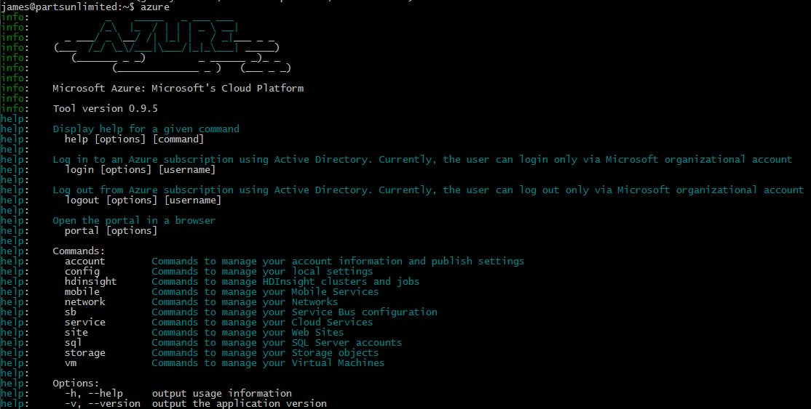
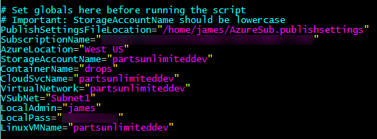
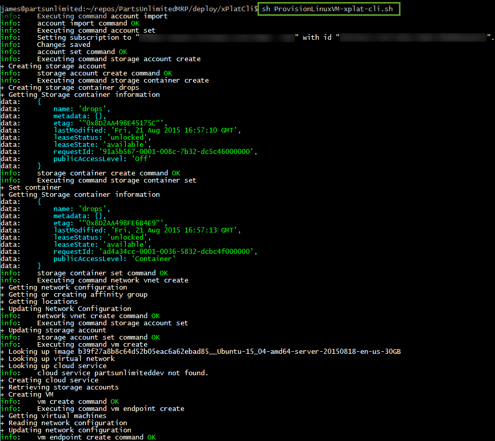
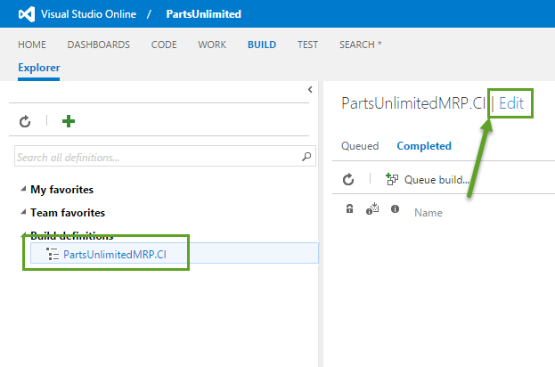
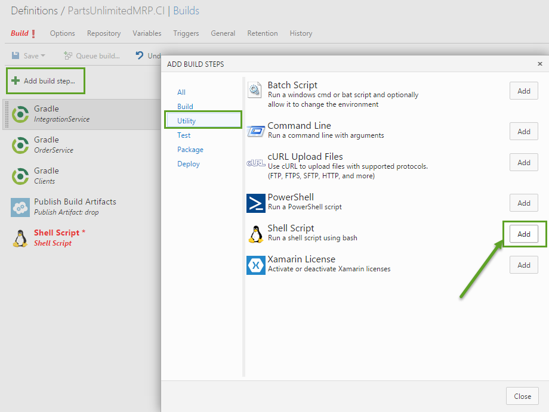
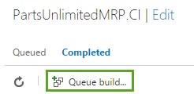
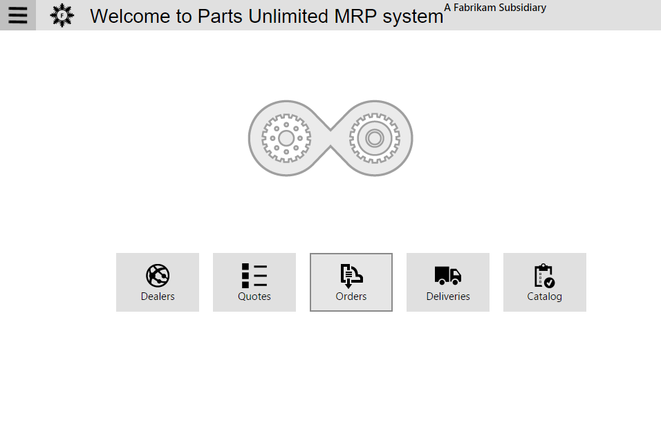

# HOL - Parts Unlimited MRP App Continuous Deployment with Visual Studio Team Services #

In this lab you will learn how to deploy the Parts Unlimited MRP App in an automated fashion. After this lab, you will have a working, automated build in Visual Studio Online that will build, test, and deploy the Parts Unlimited MRP app to a Virtual Machine in Azure.

###Pre-requisites###

- HOL Continuous Integration with Parts Unlimited MRP
- Active Azure Subscription
- Active Visual Studio Online Account

###Tasks Overview###

**Set up infrastructure in Azure to deploy to:** This step helps you set up a machine that you will be able to deploy to from an automated build in Visual Studio Team Services.

**Add build step to deploy:** You will add another task to your continuous integration build that will deploy the Parts Unlimited MRP to a virtual machine in Azure 

###1. Set up infrastructure in Azure###

The first thing we need to do is set up a virtual machine with all of the necessary dependencies in order to continuously deploy to it. 

**1.** Navigate to [https://manage.windowsazure.com/publishsettings](https://manage.windowsazure.com/publishsettings "https://manage.windowsazure.com/publishsettings") to download your profile publish settings.

**2.** **Open** the publish settings file with a text editor and **copy the contents**.

**3.** **SSH** into the Azure Virtual Machine that you turned into a Visual Studio Team Services Build Agent.

**4.** Create a **new file** by running the following command: 

    vi AzureSub.publishsettings

This will create the new file and open it in the text editor called `vi`.

**5.** We want to paste the contents of the publish settings file into the new file we created. To do so, press `i` to insert text, and then **paste the publish settings content** into the ssh session.

**6.** Press the `Esc` key, then press the key combination `Shift+:`, type `wq`, and then press `Enter`. This will write the contents to the file and then quit out of `vi`. 

**7.** Now that we have the publish settings file on the Linux machine, we need to **install the Azure CLI** using the following command:

    npm install azure-cli

You should now be able to run `azure` and get the following output:

**8.** Next, we need to navigate to following folder in the PartsUnlimitedMRP repository:

    deploy/xPlatCli

Mine is located in the sub-folder `repos/PartsUnlimitedMRP`, so I would get to the correct folder with the following command:

    cd ~/repos/PartsUnlimitedMRP/deploy/xPlatCli

**9.** **Open up** the shell script in that folder called `ProvisionLinuxVM-xplat-cli.sh` with `vi`:

    vi ProvisionLinuxVM-xplat-cli.sh

**10.** Once open, there will be a number of **variables that need to be set** before we can run the script:

- PublishSettingsFileLocation - `~/AzureSub.publishsettings`
- AzureLocation - Datacenter location to host resources (e.g. `West US`)
- SubscriptionName - Name of you subscription.
- StorageAccountName - Name of the storage account to be created
- CloudSvcName - Name of the cloud service that will host the virtual machine
- ContainerName - Name of the container to host virtual machine data disks
- VirtualNetwork - Name of the virtual network to host the virtual machine
- VSubnet - Name of the subnet that will be used in the virtual network
- LocalAdmin - Username of the local administrative account for the new virtual machine
- LocalPass - Password for the local administrative account for the new virtual machine
- LinuxVMName - Name of the virtual machine 

Use the arrow keys to navigate the cursor, and press `i` to insert text.

**11.** Once the variables have been set press `Esc`, press the key combination `Ctrl+:`, type `wq`, and then strike `Enter` to save the contents to the file.

**12.** Now, all we will need to do is **run the script** to create the infrastructure in Azure that we need:

    sh ./ProvisionLinuxVM-xplat-cli.sh

You should now have a cloud service, a virtual machine, a virtual network, and a storage account that we will use to help us deploy the PartsUnlimitedMRP application.

###2. Modify build to deploy after compilation###

**1.** Navigate to your Visual Studio Team Services account located here:

    https://<account>.visualstudio.com

**2.** Navigate to your **team project's home page**.

**3.** Go to the **Build hub** for you team project.

**4.** Select the continuous integration build we created in the HOL for Continuous Integration for PartsUnlimitedMRP and click the **Edit** link.

 

**5.** Next, click **Add build step...**, select **Utilities**, and then click the **Add** button next to the Shell Script row. Click **Close**.

**6.** Set the **script path** to:

    deploy/Upload-Deploy-Artifacts.sh

Set the **arguments** to:

    -a $(storageaccount) -k $(storageaccesskey) -c $(container) -d $(Build.StagingDirectory) -s $(Build.SourceDirectory) -m $(virtualmachine)

**7.** Click the **Variables** tab in the build definition

**8.** Add the following **variables and their values**:

- `storageaccount` - name of the Azure Storage Account (created in task one)
- `storageaccesskey` - primary key for the Azure Storage account (NOTE: click the small lock on the right of the input field to make this a private variable)
- `container` - name of the container in the Azure Storage Account (created in task one)
- `virtualmachine` - name of the virtual machine to deploy to (created in task one)

**9.** Once you're done, click the **Save button**.

**10.** Go back to your SSH session with your build virtual machine and **start up the build agent** with the following command:

    cd ~/<agent_folder>/
    node agent/vsoagent

**10.** Click on **Queue build...** to trigger a new build.

**11.** Once the build is done, all we need to do is wait for the extension to finish running the script, and the application should be running.

Your virtual machine should have a public DNS that matches this pattern:

    <virtual_machine_name>.cloudapp.net

If this is the case, you can now navigate here to see the site up and running:

    http://<virtual_machine_name>.cloudapp.net:9080/mrp

This is what the app should look like once you're done:

Next steps
----------

In this lab, you created a virtual machine to deploy to and you took the continuous integration built in that HOL and added a deployment task to the end of it. The full build process, that is triggered every time a commit is pushed to the master branch, will now get new sources, compile them, run unit tests, upload to a drop folder in Azure Blob Storage, and deploy to a target virtual machine. This is the first step to creating a continuous deployment pipeline. Try out these labs for the next steps:

 - HOL Parts Unlimited MRP Automated Testing
 - HOL Parts Unlimited MRP Application Performance Monitoring
 - HOL PArts Unlimited MRP User Telemetry
